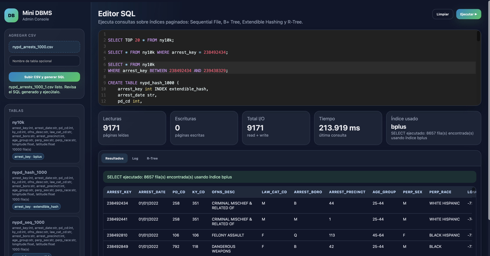

# Simulador de Gestor de Base de datos

Proyecto desarrollado para el curso **Base de Datos 2**.  
El sistema implementa un mini gestor de base de datos en Python, usando archivos binarios y acceso paginado a disco. No utiliza motores externos como PostgreSQL, MySQL, SQLite u otros.

El proyecto incluye:

- Almacenamiento por páginas de tamaño fijo.
- Carga de datos desde archivos CSV.
- Parser SQL propio.
- Estructuras de indexación:
  - Sequential File
  - Extendible Hashing
  - B+ Tree
  - R-Tree
- Interfaz web para ejecutar consultas SQL.
- Visualización tabular de resultados.
- Panel de estadísticas de ejecución.
- Visualización espacial para consultas con R-Tree.
- Simulador básico de concurrencia.
- Scripts para evaluación experimental.

## Video de demostración

El video de demostración del sistema se encuentra disponible en Google Drive:

[Ver video de demostración](https://drive.google.com/file/d/1BpTySBP5XH_zbPNfYTqSa6zzF_DIJ54N/view?usp=share_link)

## Dataset utilizado

Para las pruebas del sistema se utilizó el dataset **NYPD Arrest Data (Year to Date)** de Kaggle. Este dataset contiene información de arrestos registrados en Nueva York, incluyendo identificadores, fechas, tipos de delito, distrito y coordenadas geográficas.

[Ver dataset en Kaggle](https://www.kaggle.com/datasets/amirhosseinzinati/nypd-arrest-data-year-to-date)


## Vista de la demo



## Requisitos

Tener instalado:

- Python 3.11 o superior
- pip
- Docker y Docker Compose, si se desea ejecutar con contenedores

## Instalación local

Clonar el repositorio:

```bash
git clone <URL_DEL_REPOSITORIO>
cd Proyecto_1


